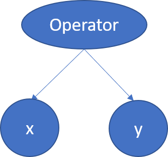

# Class and Objects


We define class in Scala using `class` keyword. `class` takes parameters with type information.


```scala
abstract class Rational(x:Int, y:Int)
```

Create new class instance with `new` operator.

```scala
class Rational(x:Int, y:Int)
val r = new Rational(2,3)
```

```{admonition} Abstract Class
:class: information

- In Java abstract classes cannot be instantiated but can only be sub classed.
- In Scala, we have traits which are far more powerful (similar to Java interfaces), but we can use `abstract` class if
  - You want to create a base class with constructor arguments
  - Your Scala code needs to be called from Java. See [Java documentation on abstract class.](https://docs.oracle.com/javase/tutorial/java/IandI/abstract.html#:~:text=An%20abstract%20class%20is%20a,but%20they%20can%20be%20subclassed.&text=When%20an%20abstract%20class%20is,methods%20in%20its%20parent%20class.)

```

## Infix Notation

In Scala, any method with operator can be used like infix operator. Write down the operator in tree form



Infix traversal of the above binary tree is `x op y`. See below example.

```scala
class Rational(val x: Int, val y:Int){
  require(y != 0)
  def add (that: Rational):Rational = new Rational((this.x * that.y + that.y * this.x),(this.y * that.y))
}

val r = new Rational(2,3)
r.add(new Rational(1,2))
r add (new Rational(1,2)) //same as above
```

```scala
on master branch on
changes made by ankit
```
---------------------

[^1]:
